## 神经网络与深度学习第一次作业

######  计科一班 陈杨 201730612499


#### 〇、课堂作业

##### 1. 梯度下降法中：求$E(w,b)$对$w$和$b$的偏导

$$
E(w,b)=MSE=\frac{1}{2m}\sum_{i=1}^{m}(y^{(i)}-f(x^{(i)}))^2
$$


$$
\begin{align}

\frac{\partial E(w,b)}{\partial w}

& = \frac{\partial}{\partial w} \frac{1}{2m}\sum_{i=1}^{m}(y^{(i)}-f(x^{(i)}))^2 \\

& = \frac{1}{2m}\sum_{i=1}^{m}\frac{\partial}{\partial w}(y^{(i)}-f(x^{(i)}))^2 \\

& = \frac{1}{2m}\sum_{i=1}^{m}2*(y^{(i)}-f(x^{(i)}))*\frac{\partial}{\partial w}(y^{(i)}-f(x^{(i)})) \\

& = \frac{1}{m}\sum_{i=1}^{m}(y^{(i)}-f(x^{(i)}))*\frac{\partial}{\partial w}(y^{(i)}-wx^{(i)}-b) \\

& = \frac{1}{m}\sum_{i=1}^{m}(y^{(i)}-f(x^{(i)}))*(-x^{(i)}) \\

& = \frac{1}{m}\sum_{i=1}^{m}(f(x^{(i)})-y^{(i)})*x^{(i)} \\

\end{align}
$$

$$
\begin{align}

\frac{\partial E(w,b)}{\partial b}

& = \frac{\partial}{\partial b} \frac{1}{2m}\sum_{i=1}^{m}(y^{(i)}-f(x^{(i)}))^2 \\

& = \frac{1}{2m}\sum_{i=1}^{m}\frac{\partial}{\partial b}(y^{(i)}-f(x^{(i)}))^2 \\

& = \frac{1}{2m}\sum_{i=1}^{m}2*(y^{(i)}-f(x^{(i)}))*\frac{\partial}{\partial b}(y^{(i)}-f(x^{(i)})) \\

& = \frac{1}{m}\sum_{i=1}^{m}(y^{(i)}-f(x^{(i)}))*\frac{\partial}{\partial b}(y^{(i)}-wx^{(i)}-b) \\

& = \frac{1}{m}\sum_{i=1}^{m}(y^{(i)}-f(x^{(i)}))*(-1) \\

& = \frac{1}{m}\sum_{i=1}^{m}(f(x^{(i)})-y^{(i)}) \\

\end{align}
$$


##### 2. 最小二乘法中：求$\frac{dE(W)}{dW}= 0$的解析解

$$
E(W) = \frac{1}{m}\sum(y-W^TX)^2 = \frac{1}{m}(y-WX)^T(y-WX)
$$


$$
\begin{align}

E(W) 

& = \frac{1}{m}(y-WX)^T(y-WX) \\

& = \frac{1}{m}(y^T-X^TW^T)(y-WX) \\

& = \frac{1}{m}(y^Ty-y^TWX-X^TW^Ty+X^TW^TWX) \\

& =  \frac{1}{m}(y^Ty-2X^TW^Ty+X^TW^TWX)

\end{align}
$$

$$
\begin{align}

\frac{dE(W)}{dW}

& = \frac{d(y^Ty-2X^TW^Ty+X^TW^TWX)}{dW} \\

& = \frac{d(X^TW^TWX-2X^TW^Ty)}{dW} \\

& = \frac{d(X^TW^TWX)}{dW}-2X^Ty \\

& = (X^TX+X^TX)W-2X^Ty \\

& = 2(X^TXW-X^Ty) \\

\end{align}
$$
令$\frac{dE(W)}{dW}= 0$，得
$$
\begin{align}

& 2(X^TXW-X^Ty) = 0 \\

& \Rightarrow X^TXW = X^Ty \\
& \Rightarrow W = (X^TX)^{-1}X^Ty

\end{align}
$$


#### 一、Numpy基本操作

##### 1. 导入numpy库

```python
import numpy as np
```


##### 2. 建立一个一维数组a，初始化为[4, 5, 6]

```python
a = np.array([4, 5, 6])
```

(1) 输出a的类型(type)

```python
print(type(a))
```

(2) 输出a的各维度大小(shape)

```python
print(a.shape)
```

(3) 输出a的第一个元素

```python
print(a[0])
```

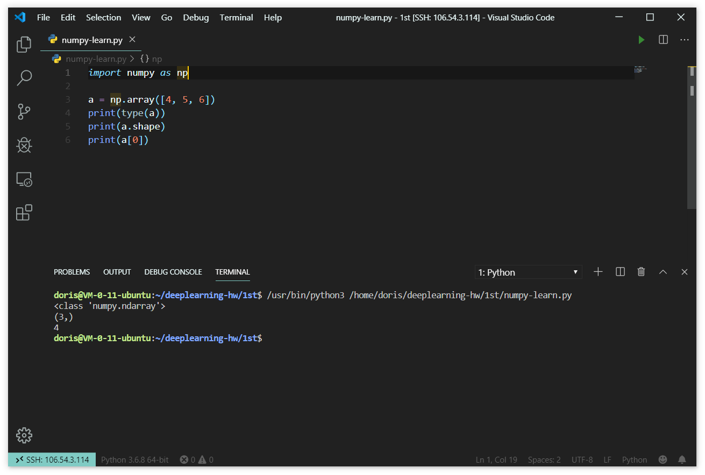


##### 3. 建立一个二维数组b，初始化为[[4, 5, 6], [1, 2, 3]]

```python
b = np.array([[4, 5, 6], [1, 2, 3]])
```

(1) 输出b的各维度大小(shape)

```python
print(b.shape)
```

(2) 输出b[0, 0], b[0, 1], b[1, 1]这三个元素

```python
print(b[0, 0], b[0, 1], b[1, 1])
```

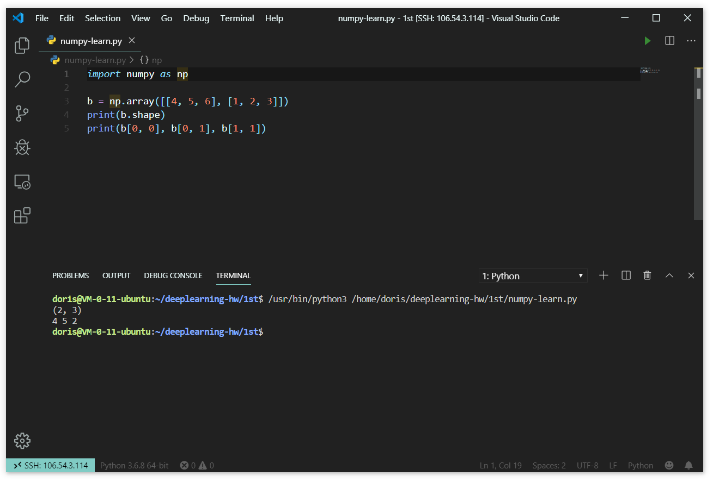


##### 4. 建立矩阵

(1) 建立一个大小为3×3的全0矩阵c

```python
c = np.zeros((3, 3))
```

(2) 建立一个大小为4×5的全1矩阵d

```python
d = np.ones((4, 5))
```

(3) 建立一个大小为4×4的单位矩阵e

```python
e = np.eye(4)
```

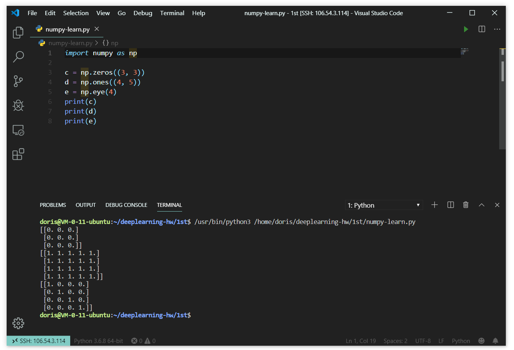


##### 5. 建立一个数组f，初始化为[0, 1, 2, 3, 4, 5, 6, 7, 8, 9, 10, 11] (arange)

```python
f = np.arange(12)
```

(1) 输出f以及f的各维度大小

```python
print(f)
print(f.shape)
```

(2) 将f的shape改为3×4(reshape)

```python
f = f.reshape(3, 4)
```

(3) 输出f以及f的各维度大小

```python
print(f)
print(f.shape)
```

(4) 输出f第二行(f[1, :])

```python
print(f[1, :])
```

(5) 输出f最后两列(f[:, 2:4])

```python
print(f[:, 2:4])
```

(6) 输出f第三行最后一个元素(使用-1表示最后一个元素)

```python
print(f[2, :][-1])
```

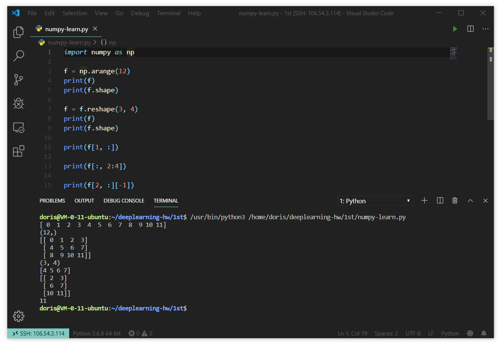


#### 二、Tensorflow练习

##### 1. 线性回归

(1) 生成训练数据数据为带有服从0.5到-0.5的均匀分布噪声的正弦函数，代码如下:

```python
num_observations = 100
x = np.linspace(-3, 3, num_observations)
y = np.sin(x) + np.random.uniform(-0.5, 0.5, num_observations)
```

画出这100个样本的散点图。

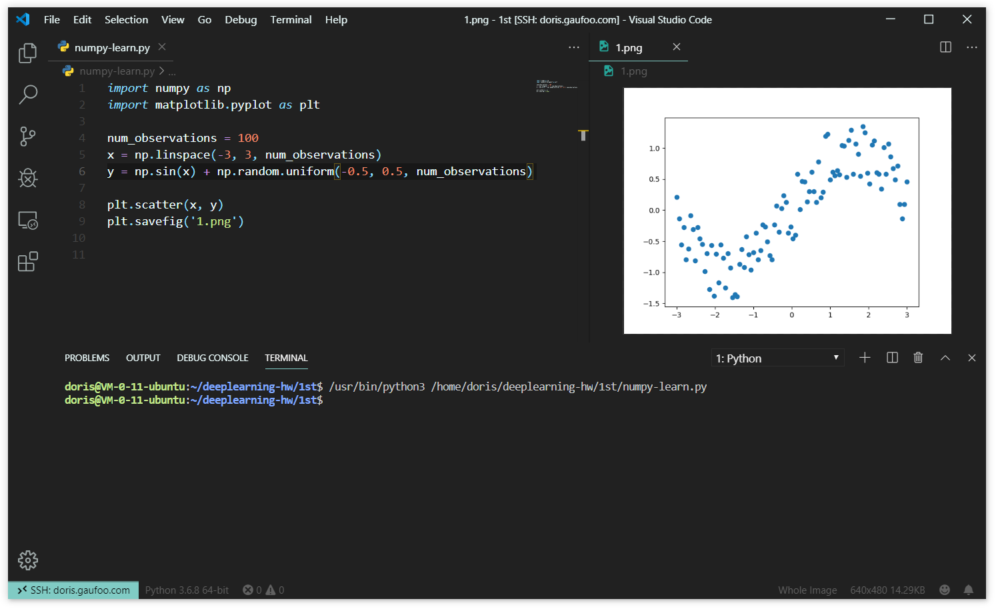

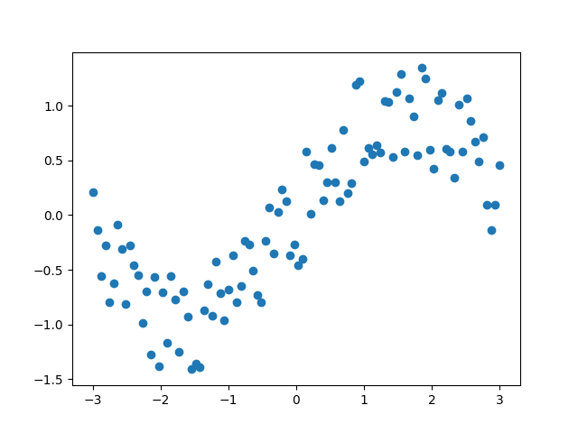


(2) 使用tensorflow实现线性回归模型，训练参数$w$和$b$。
$$
y= w * x + b
$$
- 导入模块、生成数据、定义训练集和参数

```python
# 导入必需的numpy、tensorflow、matplotlib模块，处理v1和v2以避免兼容问题
import numpy as np
import tensorflow.compat.v1 as tf
import matplotlib.pyplot as plt
tf.disable_v2_behavior()

# 生成100组带有服从0.5到-0.5的均匀分布噪声的正弦函数数据
num_observations = 100
x = np.linspace(-3, 3, num_observations)
y = np.sin(x) + np.random.uniform(-0.5, 0.5, num_observations)
n = len(x)

# 定义学习率、迭代次数
learning_rate = 0.01
training_epochs = 1000
```

- 定义模型和模型参数

```python
# 定义运行时接受训练数据的占位符
X = tf.placeholder("float")
Y = tf.placeholder("float")

# 定义模型参数
W = tf.Variable(np.random.randn(), name="W")
b = tf.Variable(np.random.randn(), name="b")

# 定义模型、损失函数、优化算法
y_pred = tf.add(tf.multiply(X, W), b)
cost = tf.reduce_sum(tf.pow(y_pred - Y, 2)) / (2 * n)
optimizer = tf.train.GradientDescentOptimizer(learning_rate).minimize(cost)
```

- 初始化

```python
# 初始化所有变量
init = tf.global_variables_initializer()
```

- 开始训练

```python
with tf.Session() as sess:
    
	# 初始化
    sess.run(init)
	
    # 进行每趟训练
    for epoch in range(training_epochs):
        for (_x, _y) in zip(x, y):
            sess.run(optimizer, feed_dict={X: _x, Y: _y})

        if (epoch + 1) % 50 == 0:
            c = sess.run(cost, feed_dict={X: x, Y: y})
            print("Epoch", (epoch + 1), ": cost =", c,
                  "W =", sess.run(W), "b =", sess.run(b))
    
    # 训练最终结果          
    training_cost = sess.run(cost, feed_dict ={X: x, Y: y})
    weight = sess.run(W)
    bias = sess.run(b)
```

- 图形化训练集和训练结果

```python
# 输出结果
predictions = weight * x + bias 
print("Training cost =", training_cost, 
      "Weight =", weight, "bias =", bias, '\n') 

# 画图
plt.figure()
plt.plot(x, y, 'ro', label ='Original data') 
plt.plot(x, predictions, label ='Fitted line') 
plt.title('Linear Regression Result') 
plt.legend() 
plt.savefig("result.png")
```


(3) 输出参数$w$、$b$和损失。

```python
print("Training cost =", training_cost, 
      "Weight =", weight, 
      "bias =", bias, '\n') 
```

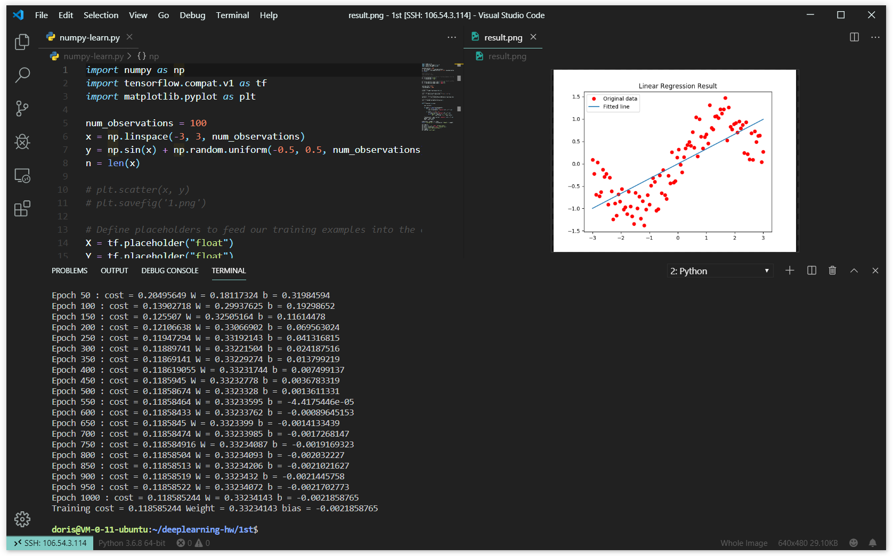

由输出结果可知最终损失为0.119，参数分别为$w=0.332$、$b=-0.002$。

即最终回归方程为：$y = 0.332 x - 0.002$。


(4) 画出预测回归曲线以及训练数据散点图，对比回归曲线和散点图并分析原因。

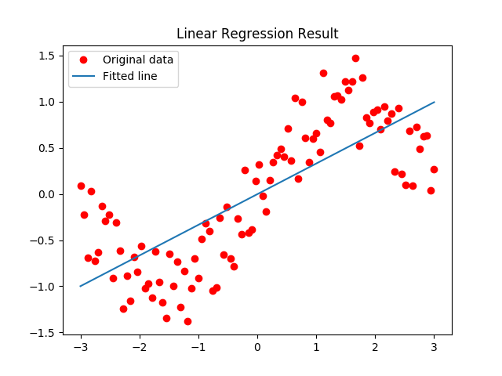

对比原始数据散点图以及训练得到的回归曲线，可以看出回归曲线并不能反映数据分布。原因在于选取了不合适的函数模型进行拟合，不应使用一次函数拟合正弦函数，应尝试使用其他函数模型进行线性回归。


##### 2. 线性回归(使用多项式函数对原始数据进行变换)

(1)生成训练数据，数据同上。


(2)使用tensorflow实现线性回归模型，这里我们假设$y$是$x$的三次多项式，那么我们可以将数据拓展为：$x$、$x^2$、$x^3$三维数据，此时模型变为：
$$
y = w_1 * x + w_2 * x^2 + w_3 * x^3 + b
$$


(3)训练模型并输出参数$w_1$、$w_2$、$w_3$、$b$和损失。

- 在之前的代码中新添参数并作小幅修改

```python
# 增添参数W_2和W_3、修改模型为多项式
W_2 = tf.Variable(np.random.randn(), name="W2")
y_pred = tf.add(tf.multiply(tf.pow(X, 2), W_2), y_pred)
W_3 = tf.Variable(np.random.randn(), name="W3")
y_pred = tf.add(tf.multiply(tf.pow(X, 3), W_3), y_pred)
```

- 输出参数和损失

```python
print("Training cost =", training_cost, 
          "Weight =", weight, 
          "Weight2 =", weight2, 
          "Weight3 =", weight3,
          "bias =", bias, '\n') 
```

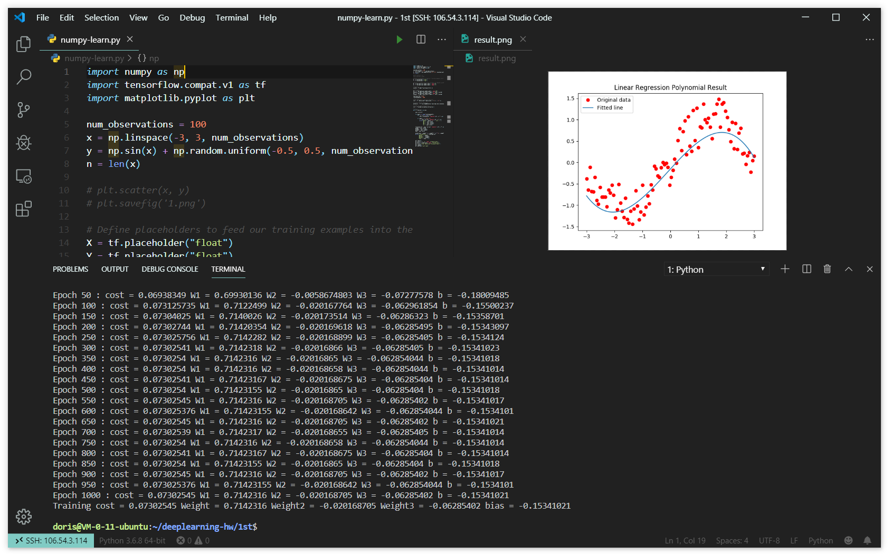

由输出结果可知最终损失为0.073，参数分别为$w_1=0.714$、$w_2=-0.020$、$w_3=-0.063$、$b=-0.153$。

即最终回归方程为：$y = 0.714x - 0.020x^2 - 0.063x^3 - 0.153$。


(4)画出预测回归曲线以及训练数据散点图，对比回归曲线和散点图并分析原因。

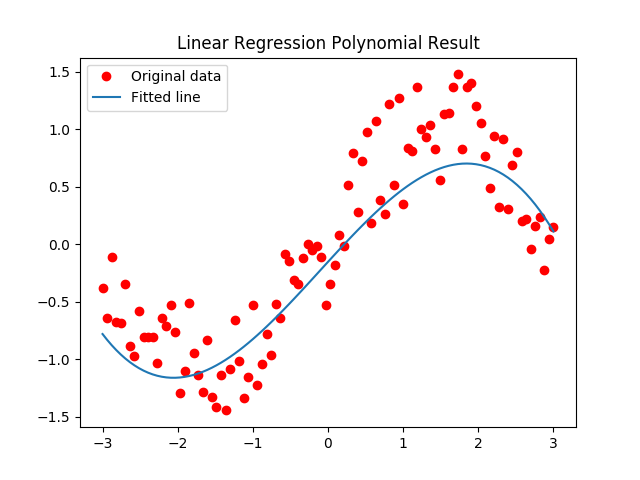

对比原始数据散点图以及训练得到的回归曲线，可以看出回归曲线能够较好地反映数据分布，但是损失函数得到的最终损失还是不够小，原因在于初始参数或模型欠佳。或许需要尝试调整学习率等初始化参数、改变优化算法、更换函数模型等，以使回归模型更贴合训练数据。


##### 3. Softmax分类

(1)获取MNIST数据集，每张图片像素为28×28。

```python
# 获取MNIST数据集
from tensorflow.examples.tutorials.mnist import input_data
mnist = input_data.read_data_sets("MNIST_data/", one_hot=True)
```


(2)模型架构为：
$$
y = softmax(w * x + b)
$$
其中$w$的维度为784×10，$b$的维度为10。

- 定义计算图

```python
# 定义图像参数、学习率、训练次数
num_features = 784
num_labels = 10
learning_rate = 0.05
batch_size = 128
num_steps = 5001

# 定义输入图像数据
train_dataset = mnist.train.images
train_labels  = mnist.train.labels
test_dataset  = mnist.test.images
test_labels   = mnist.test.labels
valid_dataset = mnist.validation.images
valid_labels  = mnist.validation.labels

# 定义模型参数
graph = tf.Graph()

with graph.as_default():
    tf_train_dataset = tf.placeholder(
        tf.float32, shape=(batch_size, num_features))
    tf_train_labels = tf.placeholder(
        tf.float32, shape=(batch_size, num_labels))
    tf_valid_dataset = tf.constant(valid_dataset)
    tf_test_dataset = tf.constant(test_dataset)

    # 定义Softmax模型参数
    weights = tf.Variable(tf.truncated_normal([num_features, num_labels]))
    biases = tf.Variable(tf.zeros([num_labels]))

    # 定义损失函数(交叉熵)
    logits = tf.matmul(tf_train_dataset, weights) + biases
    loss = tf.reduce_mean(tf.nn.softmax_cross_entropy_with_logits(
        labels=tf_train_labels, logits=logits))

    # 定义优化模型(梯度下降)
    optimizer = tf.train.GradientDescentOptimizer
    			(learning_rate).minimize(loss)

   # 训练、验证、测试预测
    train_prediction = tf.nn.softmax(logits)
    valid_prediction = tf.nn.softmax(
        tf.matmul(tf_valid_dataset, weights) + biases)
    test_prediction = tf.nn.softmax(
        tf.matmul(tf_test_dataset, weights) + biases)
    
# 定义准确率
def accuracy(predictions, labels):
    correctly_predicted = np.sum(
        np.argmax(predictions, 1) == np.argmax(labels, 1))
    accu = (100.0 * correctly_predicted) / predictions.shape[0]
    return accu
```

- 开始训练

```python
with tf.Session(graph=graph) as session:
    
    # 初始化
    tf.global_variables_initializer().run()
    
    # 进行每趟训练
    for step in range(num_steps):
        
        # 随机生成偏移量
        offset = np.random.randint(0, train_labels.shape[0] - batch_size - 1)

        # 批训练
        batch_data = train_dataset[offset:(offset + batch_size), :]
        batch_labels = train_labels[offset:(offset + batch_size), :]

        feed_dict = {tf_train_dataset: batch_data,
                     tf_train_labels: batch_labels}

        _, l, predictions = session.run([optimizer, loss, train_prediction], 										 feed_dict=feed_dict)
        
        # 计算准确率
        maccuracy = accuracy(predictions, batch_labels)
        vaccuracy = accuracy(valid_prediction.eval(), valid_labels)

        if (step % 500 == 0):
            print("Minibatch loss at step {0}: {1}".format(step, l))
            print("Minibatch accuracy: {:.1f}%".format(maccuracy))
            print("Validation accuracy: {:.1f}%\n".format(vaccuracy))
```

- 输出准确率

```python
finalLoss = session.run(loss, feed_dict=feed_dict)
finalAccuracy = accuracy(test_prediction.eval(), test_labels)

print("\nLoss: {}".format(finalLoss))
print("Test accuracy: {:.1f}%".format(finalAccuracy))
```

- 画图

```python
# 损失随迭代次数变化图
plt.figure()
plt.plot(figurex, figurey1)
plt.title("Loss along the iterate times")
plt.xlabel("Iterate times")
plt.ylabel("Loss")
plt.savefig("loss.png")

# 准确率随迭代次数变化图
plt.figure()
plt.plot(figurex, figurey2)
plt.title("Accuracy along the iterate times")
plt.xlabel("Iterate times")
plt.ylabel("Accuracy")
plt.savefig("accuracy.png")
```

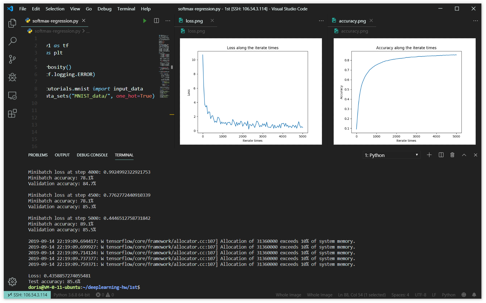

由输出结果可知最终损失为0.436，准确率为85.6%。


(3)画出训练和测试过程的准确率随迭代次数变化图，画出训练和测试过程的损失随迭代次数变化图。

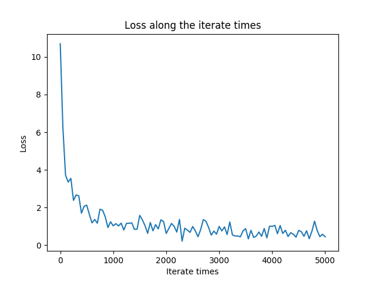

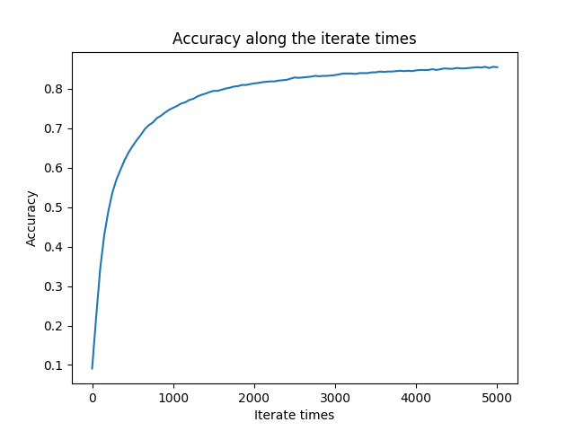

随着迭代次数的增加，损失逐渐下降，准确率逐渐上升。且在迭代次数较少时，损失和准确率随迭代次数变化的变化率较大，随后变化率逐渐减少并趋于平缓。