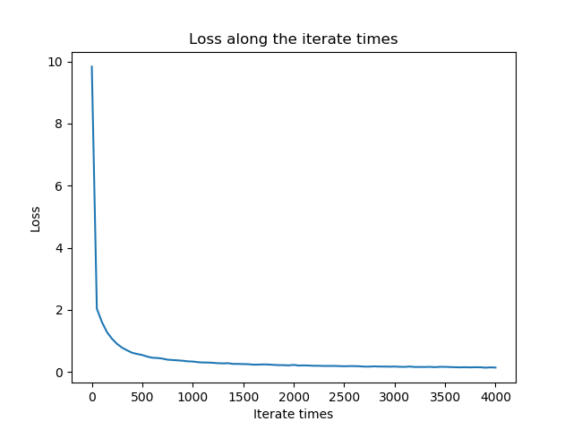

##  神经网络与深度学习第二次作业

###### 计科一班 陈杨 201730612499


#### 〇、课堂作业

##### 在随时间反向传播算法(BPTT)中，求L对U的梯度

$$
\frac{\partial L}{\partial U}=\sum_{t=1}^{T}\sum_{kt=1}^{t}\delta_{t,k}\otimes{x_k}
$$

由链式法则得
$$
\frac{\partial L_t}{\partial U} = \sum_{k=1}^{t}\frac{\partial s_k}{\partial U}\frac{\partial L_t}{\partial s_k}
$$
其中每一个元素为
$$
\frac{\partial L_t}{\partial U_{i,j}} =\sum_{k=1}^{t}(\frac{\partial L_t}{\partial s_k})^{T}\frac{\partial s_k}{\partial U_{i,j}}
$$
对于前一项，定义$\delta_{t,k}=\frac{\partial L_t}{\partial s_k}$
$$
\begin{align}

\delta_{t,k}

& = \frac{\partial L_t}{\partial s_k} \\

& = \frac{\partial h_k}{\partial s_k}\frac{\partial s_{k+1}}{\partial h_k}\frac{\partial L_t}{\partial s_{k+1}} \\

& = diag(f'(s_k))W^T\delta_{t,k+1} \\

& = f'(s_k)\odot(W^T\delta_{t,k+1})

\end{align}
$$
当$t = k$时
$$
\begin{align}

\delta_{t,t}

& = \frac{\partial L_t}{\partial s_t} \\

& = \frac{\partial h_t}{\partial s_t}\frac{\partial z_t}{\partial h_t}\frac{\partial L_t}{\partial z_t} \\

& = diag(f'(s_t))V^T(\hat{y}_t-y_t) \\

& = f'(s_t)\odot(V^T(\hat{y}_t-y_t))

\end{align}
$$
对于后一项
$$
\frac{\partial s_k}{\partial U_{i,j}}=\frac{\partial (Wh_{k-1}+Ux_k)}{\partial U_{i,j}} = (0,...,[x_k]_j,...,0)^T
$$
所以
$$
\frac{\partial L_t}{\partial U_{i,j}} =\sum_{k=1}^{t}{[\delta_{t,k}]}_i{[x_k]}_j
$$

$$
\frac{\partial L_t}{\partial U} = \sum_{k=1}^{t}\delta_{t,k}{x_k}^T = \sum_{k=1}^{t}\delta_{t,k}\otimes{x_k}
$$

$$
\frac{\partial L}{\partial U} = \sum_{t=1}^{T}\sum_{k=1}^{t}\delta_{t,k}\otimes{x_k}
$$


#### 一、多层感知机用于MNIST手写数字数据集分类

##### 1. 获取MNIST数据集，每张图片像素为28×28

```python
# 获取MNIST数据集
from tensorflow.examples.tutorials.mnist import input_data
mnist = input_data.read_data_sets("MNIST_data/", one_hot=True)
```


##### 2. 模型架构为包含两个隐含层的多层感知机模型

##### 输入层维度: 28×28=784
##### 第一层隐含单元数: 256
##### 第二层隐含单元数: 256
##### 输出层维度: 10

- 定义模型

```python
# 定义超参数
learning_rate = 0.005
batch_size = 100
training_epochs = 4001

# 定义各层单元数
num_input = 784
num_hidden_1 = 256
num_hidden_2 = 256
num_output = 10

X = tf.placeholder(tf.float32, [None, num_input])
Y = tf.placeholder(tf.float32, [None, num_output])

# 定义各层权重
w1 = tf.Variable(tf.random_normal([num_input, num_hidden_1]))
w2 = tf.Variable(tf.random_normal([num_hidden_1, num_hidden_2]))
w3 = tf.Variable(tf.random_normal([num_hidden_2, num_output]))

# 定义各层偏置
b1 = tf.Variable(tf.random_normal([num_hidden_1]))
b2 = tf.Variable(tf.random_normal([num_hidden_2]))
b3 = tf.Variable(tf.random_normal([num_output]))

# 隐层使用RELU激活函数、输出层使用线性激活函数
layer1 = tf.nn.relu(tf.add(tf.matmul(X, w1), b1))
layer2 = tf.nn.relu(tf.add(tf.matmul(layer1, w2), b2))
logits = tf.add(tf.matmul(layer2, w3), b3)

# 定义损失、优化器、准确率
loss = tf.reduce_mean(tf.nn.softmax_cross_entropy_with_logits
                      (logits=logits, labels=Y))
optimizer = tf.train.GradientDescentOptimizer(learning_rate=learning_rate)
					  .minimize(loss)
accuracy = tf.reduce_mean(tf.cast(tf.equal
                      (tf.math.argmax(logits, 1), tf.math.argmax(Y, 1)), 
                      tf.float32))
```


- 开始训练

```python
with tf.Session() as sess:
    
    # 初始化
    tf.global_variables_initializer().run()
    
    # 进行每趟训练
    for epoch in range(training_epochs):
        batch_data, batch_label = mnist.train.next_batch(batch_size)
        sess.run(optimizer, feed_dict={X: batch_data, Y: batch_label})
        if epoch % 50 == 0:
            l, a = sess.run([loss, accuracy], 
                            feed_dict={X: mnist.test.images, 
                                       Y: mnist.test.labels})
            print("Epoch:{0} loss={1} accuracy={2}".format(epoch, l, a))
```


- 输出准确率

```python
finalLoss, finalAccuracy = sess.run([loss, accuracy], 
                                    feed_dict={X: mnist.test.images, 
                                               Y: mnist.test.labels})
print("\nloss={0} accuracy={1}".format(finalLoss, finalAccuracy))
```


- 画图

```python
# 损失随迭代次数变化图
plt.figure()
plt.plot(range(0, training_epochs, 50), figurey_loss)
plt.title("Loss along the iterate times")
plt.xlabel("Iterate times")
plt.ylabel("Loss")
plt.savefig("mlp-loss.png")

# 准确率随迭代次数变化图
plt.figure()
plt.plot(range(0, training_epochs, 50), figurey_accuracy)
plt.title("Accuracy along the iterate times")
plt.xlabel("Iterate times")
plt.ylabel("Accuracy")
plt.savefig("mlp-accuracy.png")
```


由输出结果可知最终损失为9.964，准确率为92.6%。


##### 3. 画出训练和测试过程的损失随迭代次数变化图，画出训练和测试过程的准确率随迭代次数变化图。


随着迭代次数的增加，损失逐渐下降，准确率逐渐上升。且在迭代次数较少时，损失和准确率随迭代次数变化的变化率较大，随后变化率逐渐减少并趋于平缓。


#### 二、卷积神经网络用于MNIST手写数字数据集分类

##### 1. 获取MNIST数据集，每张图片像素为28×28

```python
# 获取MNIST数据集
from tensorflow.examples.tutorials.mnist import input_data
mnist = input_data.read_data_sets("MNIST_data/", one_hot=True)
```


##### 2. 模型架构：

##### 输入层维度: 28×28=784

##### (卷积层和池化层的padding都是用‘SAME’)
##### 卷积层1: 卷积核大小为5×5，卷积核个数为32 (输出维度为28×28×32)

##### 池化层1: 使用最大池化，核大小为2×2，stride为2 (输出维度为14×14×32)

##### 卷积层2: 卷积核大小为5×5，卷积核个数为64 (输出维度为14×14×64)

##### 池化层2: 使用最大池化，核大小为2×2，stride为2 (输出维度为7×7×64)

##### (将池化层2的输出展平作为全连接层的输入，输入维度为 7×7×64=3136)

##### 全连接层: 隐含单元数为1024

##### Dropout层: Dropout率为0.25

##### 输出层维度: 10

- 定义模型

```python
# 定义超参数
dropout_rate = 0.25
learning_rate = 0.01
batch_size = 100
training_epochs = 4001
padding = "SAME"

# 定义输入输出层单元数
num_input = 784
num_output = 10

X = tf.placeholder(tf.float32, [None, num_input])
Y = tf.placeholder(tf.float32, [None, num_output])
X_ = tf.reshape(X, [-1, 28, 28, 1])

# 定义各层权重
w1 = tf.Variable(tf.truncated_normal([5, 5, 1, 32], stddev=0.1))
w2 = tf.Variable(tf.truncated_normal([5, 5, 32, 64], stddev=0.1))
w3 = tf.Variable(tf.truncated_normal([3136, 1024], stddev=0.1))
w4 = tf.Variable(tf.truncated_normal([1024, 10], stddev=0.1))

# 定义各层偏置
b1 = tf.Variable(tf.constant(0.1, shape=[32]))
b2 = tf.Variable(tf.constant(0.1, shape=[64]))
b3 = tf.Variable(tf.constant(0.1, shape=[1024]))
b4 = tf.Variable(tf.constant(0.1, shape=[10]))

# 进行第一层卷积和第一层池化
c1 = tf.nn.conv2d(X_, w1, strides=[1, 1, 1, 1], padding=padding)
layer_1 = tf.nn.relu(tf.nn.bias_add(c1, b1))
p1 = tf.nn.max_pool(layer_1, ksize=[1, 2, 2, 1],
                    strides=[1, 2, 2, 1], padding=padding)

# 进行第二层卷积和第二层池化
c2 = tf.nn.conv2d(p1, w2, strides=[1, 1, 1, 1], padding=padding)
layer_2 = tf.nn.relu(tf.nn.bias_add(c2, b2))
p2 = tf.nn.max_pool(layer_2, ksize=[1, 2, 2, 1], 
                    strides=[1, 2, 2, 1], padding=padding)

# 定义全连接层
layer_full_connection = tf.nn.relu(tf.nn.bias_add
                        (tf.matmul(tf.reshape(p2, [-1, 3136]), w3), b3))

# 定义Dropout层
layer_dropout = tf.nn.dropout(layer_full_connection, dropout_rate)

# 定义输出层
logits = tf.nn.bias_add(tf.matmul(layer_dropout, w4), b4)

# 定义损失函数、优化器、准确率
loss = tf.reduce_mean(tf.nn.softmax_cross_entropy_with_logits
                        (logits=logits, labels=Y))
optimizer = tf.train.GradientDescentOptimizer(learning_rate=learning_rate)
			  			.minimize(loss)
accuracy = tf.reduce_mean(tf.cast(tf.equal
                        (tf.math.argmax(logits, 1), tf.math.argmax(Y, 1)),
                        tf.float32))
```


- 开始训练

```python
with tf.Session() as sess:
    
    # 初始化
    tf.global_variables_initializer().run()
    
    # 进行每趟训练
    for epoch in range(training_epochs):
        batch_data, batch_label = mnist.train.next_batch(batch_size)
        sess.run(optimizer, feed_dict={X: batch_data, Y: batch_label})
        if epoch % 50 == 0:
            l, a = sess.run([loss, accuracy], 
                            feed_dict={X: mnist.test.images, 
                                       Y: mnist.test.labels})
            print("Epoch:{0} loss={1} accuracy={2}".format(epoch, l, a))
```


- 输出准确率

```python
finalLoss, finalAccuracy = sess.run([loss, accuracy], 
                                    feed_dict={X: mnist.test.images, 
                                               Y: mnist.test.labels})
print("\nloss={0} accuracy={1}".format(finalLoss, finalAccuracy))
```


- 画图

```python
# 损失随迭代次数变化图
plt.figure()
plt.plot(range(0, training_epochs, 50), figurey_loss)
plt.title("Loss along the iterate times")
plt.xlabel("Iterate times")
plt.ylabel("Loss")
plt.savefig("cnn-loss.png")

# 准确率随迭代次数变化图
plt.figure()
plt.plot(range(0, training_epochs, 50), figurey_accuracy)
plt.title("Accuracy along the iterate times")
plt.xlabel("Iterate times")
plt.ylabel("Accuracy")
plt.savefig("cnn-accuracy.png")
```


由输出结果可知最终损失为0.139，准确率为95.7%。


##### 3. 画出训练和测试过程的损失随迭代次数变化图，画出训练和测试过程的准确率随迭代次数变化图。




随着迭代次数的增加，损失逐渐下降，准确率逐渐上升。且在迭代次数较少时，损失和准确率随迭代次数变化的变化率较大，随后变化率逐渐减少并趋于平缓。


#### 三、多层感知机实现异或运算

##### 要求: 不允许使用Tensorflow等深度学习框架，使用Python实现网络的前向传播和反向传播过程。

- 定义激活函数、损失函数及其导数

```python
def sigmoid(x):
    return 1.0 / (1.0 + math.exp(-x))


def sigmoid_derivative(x):
    return x * (1.0 - x)


def mse(output, expected):
    return (expected - output) ** 2


def mse_derivative(output, expected):
    return expected - output
```


- 定义神经元

```python
class Neuron:
    
    # 一个神经元包含对前一层的所有权值、偏置、输出、delta
    def __init__(self, weights, bias):
        self.weights = weights
        self.bias = bias
        self.delta = None
        self.output = None

    # 神经元更新权重和偏置，由公式 w=w+delta*input*alpha 和 b=b+delta*1*alpha 得出
    def update(self, inputs, learning_rate):
        for i in range(len(inputs)):
            self.weights[i] += self.delta * inputs[i] * learning_rate
        self.bias += self.delta * learning_rate

    # 神经元进行前向传播，即对本层输入进行加权求和
    def feedforward(self, inputs):
        weighted_sum = 0.0
        for i in range(len(inputs)):
            weighted_sum += inputs[i] * self.weights[i]
        weighted_sum += self.bias
        self.output = sigmoid(weighted_sum)
        return self.output
```


- 定义层

```python
class Layer:
    
    # 一个层包含多个神经元，即一个神经元列表
    def __init__(self, neurons):
        self.neurons = neurons

    # 层更新权重和偏置，即对层中的每一个神经元更新权重和偏置
    def update(self, inputs, learning_rate):
        for n in self.neurons:
            n.update(inputs, learning_rate)

    # 层进行前向传播，即对层中的每一个神经元进行前向传播
    def feedforward(self, inputs):
        for n in self.neurons:
            n.feedforward(inputs)

    # 由于神经元更新和前向传播需要inputs，而某层神经元的inputs等于前一层outputs
    # 故对层实现outputs函数，用于返回本层输出
    def outputs(self):
        output_list = []
        for n in self.neurons:
            output_list.append(n.output)
        return output_list
```


- 定义网络

```python
class Network:
    
    # 一个网络包含多个层，即一个层列表
    def __init__(self):
        self.layers = []

    # 网络中追加一层，并随机初始化该层
    def append_layer(self, in_dimension, out_dimension):
        neurons = []
        for _ in range(out_dimension):
            weights = []
            for _ in range(in_dimension):
                weights.append(random())
            bias = random()
            neuron = Neuron(weights, bias)
            neurons.append(neuron)
        layer = Layer(neurons)
        self.layers.append(layer)

    # 网络更新权重和偏置，即对网络中的每一层更新权重和偏置
    def update(self, inputs, learning_rate):
        for layer in self.layers:
            layer.update(inputs, learning_rate)
            inputs = layer.outputs()

    # 网络前向传播，即对网络中的每一层进行前向传播
    def feedforward(self, inputs):
        for layer in self.layers:
            layer.feedforward(inputs)
            inputs = layer.outputs()
        return inputs

    # 网络反向传播中的计算每层delta(ppt p31)
    def feedback(self, expected):
        
        # 当是输出单元时，由公式 delta = teaching - output 得
        for i in range(len(expected)):
            rightmost_layer = self.layers[-1]
            neuron = rightmost_layer.neurons[i]
            neuron.delta = mse_derivative(neuron.output, expected[i])

        # 当是隐层单元时，由公式 delta = derivative * sum_error 得
        for i in range(len(self.layers) - 2, -1, -1):
            left_layer = self.layers[i]
            right_layer = self.layers[i + 1]
            for j in range(len(left_layer.neurons)):
                error = 0.0
                for rn in right_layer.neurons:
                    error += rn.weights[j] * rn.delta
                neuron = left_layer.neurons[j]
                neuron.delta = error * sigmoid_derivative(neuron.output)

    # 网络计算损失
    def get_loss(self, dataset):
        loss = 0.0
        for data in dataset:
            outputs = self.feedforward(data[0])
            expected = data[1]
            for i in range(len(expected)):
                loss += mse(outputs[i], expected[i])
        loss /= len(dataset)
        return loss
```


- 初始化

```python
# 初始化训练数据
dataset = [[[0, 0], [0]],
           [[0, 1], [1]],
           [[1, 0], [1]],
           [[1, 1], [0]]]

# 初始化学习率和训练次数
learning_rate = 0.3
training_epochs = 3001

# 初始化网络
network = Network()
network.append_layer(2, 2)
network.append_layer(2, 2)
network.append_layer(2, 1)
```


- 进行训练

```python
# 进行每趟训练
for epoch in range(training_epochs):
    shuffle(dataset)
    for data in dataset:
        train_datum = data[0]
        train_label = data[1]
        
        # 前向传播、反向传播
        network.feedforward(train_datum)
        network.feedback(train_label)
        network.update(train_datum, learning_rate)

    if epoch % 50 == 0:
        loss = network.get_loss(dataset)
        print("Epoch: {0}, loss: {1}".format(epoch, loss))
```


- 画图

```python
plt.figure()
plt.plot(range(0, training_epochs, 50), figurey)
plt.xlabel("Iterate times")
plt.ylabel("Loss along the iterate times")
plt.savefig("mlp-xor-loss.png")
```


- 结果


由输出结果可知最终损失为$7.513*10^{-6}$。


随着迭代次数的增加，损失逐渐下降，并在最终趋于0。