## 神经网络与深度学习第三次作业

###### 计科一班 陈杨 201730612499


#### 一、循环神经网络用于预测任务

##### 1. 构建标准循环神经网络进行预测任务

##### (1)数据生成：使用函数$y=sin(0.06x)+U(-0.1,0.1),x=1,2,...,600$ 生成600个样本点，U为均匀分布，可视化样本。

- 生成数据

```python
num_observations = 600
x = np.linspace(1, num_observations, num_observations)
y = np.sin(0.06 * x) + np.random.uniform(-0.1, 0.1, num_observations)
```


- 可视化样本

```python
plt.scatter(x, y)
plt.savefig('data.png')
```


- 结果

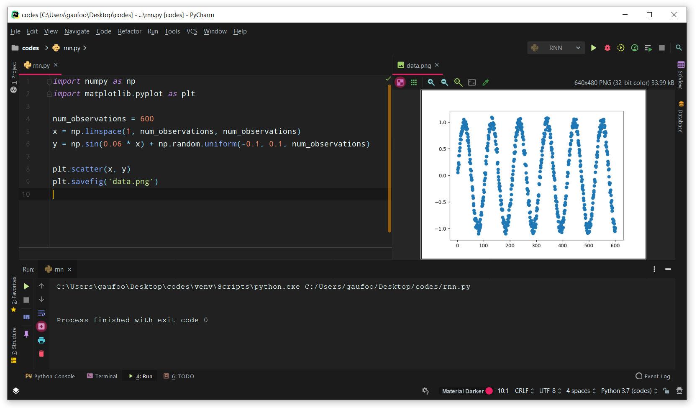

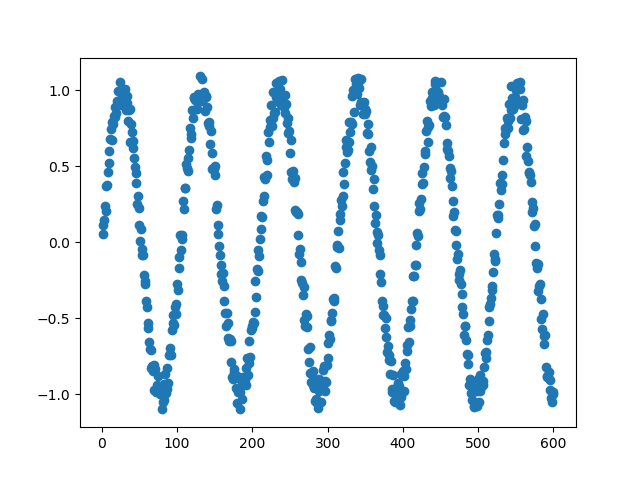

训练集样本点：前面$600\times 0.7=420$个样本点

测试集样本点：后面$600\times 0.3=180$个样本点

将循环神经网络的时间步长设置为7，那么训练集大小为：$420-7=413$；测试集大小为：$180-7=173$。

例子：

> 输入[1, 2, 3, 4, 5, 6, 7]时刻的真实值，预测第[8]时刻的值
>
> 输入[2, 3, 4, 5, 6, 7, 8]时刻的真实值，预测第[9]时刻的值


##### (2)模型架构：构建时间步长为7，隐层单元数为32的循环神经网络，取最后一个时间步的隐层状态作为输出层的输入。输出层使用一个全连接层：

$$
prediction=last\_state*w+b
$$
##### 其中$w$为$32 \times 1$，$b$的维度为1。

- 用生成数据构造训练集、测试集

```python
train_input = []
train_output = []
test_input = []
test_output = []

# 通过循环构造时间步长为7的训练集
for i in range(1, 414, 1):
    data = []
    for j in range(7):
        data.append(y[i + j - 1])
    train_input.append(data)
    train_output.append(y[i + 7 - 1])

# 构造标准shape的训练数据
train_input = np.reshape(train_input, (413, 7))
train_output = np.reshape(train_output, (413, 1))

# 通过循环构造时间步长为7的测试集
for i in range(421, 594, 1):
    data = []
    for j in range(7):
        data.append(y[i + j - 1])
    test_input.append(data)
    test_output.append(y[i + 7 - 1])

# 构造标准shape的测试数据
test_input = np.reshape(test_input, (173, 7))
test_output = np.reshape(test_output, (173, 1))
```


- 定义模型

```python
# 定义超参数
learning_rate = 0.01
training_epochs = 501

# 定义占位符
X = tf.placeholder(tf.float32, [None, 7])
Y = tf.placeholder(tf.float32, [None, 1])

# 定义权重、偏置
w = tf.Variable(tf.truncated_normal([32, 1], stddev=.1))
b = tf.Variable(tf.truncated_normal([1], stddev=.1))

# 定义隐层单元数为32的循环神经网络、最后一层为全连接的输出层
cell = tf.nn.rnn_cell.BasicRNNCell(num_units=32)
_, last_state = tf.nn.dynamic_rnn(cell, 
                                  tf.reshape(X, [-1, 7, 1]), dtype=tf.float32)
prediction = tf.nn.bias_add(tf.matmul(last_state, w), b)

# 定义损失、优化器
loss = tf.reduce_mean(tf.pow(prediction - Y, 2))
optimizer = tf.train.AdamOptimizer(learning_rate=learning_rate).minimize(loss)
```


- 开始训练

```python
with tf.Session() as sess:
    
    # 初始化
    tf.global_variables_initializer().run()
    
    # 进行每趟训练
    for epoch in range(training_epochs):
        batch = np.random.choice(train_input.shape[0], 100)
        sess.run(optimizer, feed_dict={X: train_input[batch], 
                                       Y: train_output[batch]})
        if epoch % 10 == 0:
            l = sess.run(loss, feed_dict={X: train_input, Y: train_output})
            print("Epoch:{0} loss={1}".format(epoch, l))

    test_prediction = sess.run(prediction, feed_dict={X: test_input})
```


- 画图

```python
# 测试集上预测值和真实值对比图
plt.figure()
plt.legend((plt.scatter(x[427:], test_output),
            plt.scatter(x[427:], test_prediction)),
           ("Truth", "Prediction"))
plt.savefig('rnn-difference.png')

# 损失随迭代次数变化图
plt.figure()
plt.plot(range(0, training_epochs, 10), loss_list)
plt.title("Loss along the iterate times")
plt.xlabel("Iterate times")
plt.ylabel("Loss")
plt.savefig("rnn-loss.png")
```

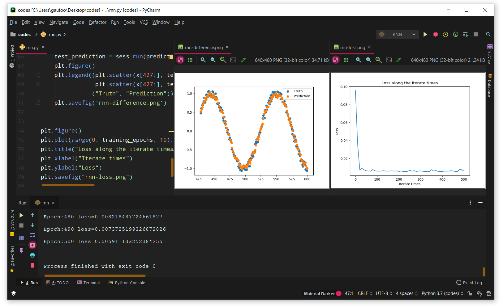

由输出结果可知最终损失为0.0059。


##### (3)画出训练误差随迭代次数的变化图以及测试集的预测值和真实值的对比图。

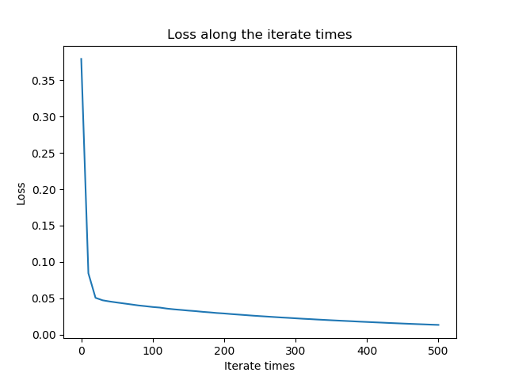

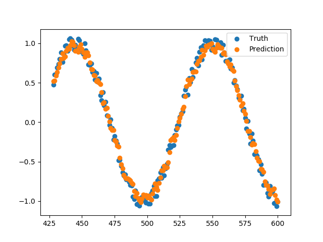


##### 2. 构建LSTM循环神经网络进行预测任务

- LSTM循环神经网络的代码实现与上一题标准循环神经网络类似，不同之处在于：

  - 定义网络隐层单元时

  ```python
  cell = tf.nn.rnn_cell.BasicLSTMCell(num_units=32)
  ```

  - 计算预测数据时

  ```python
  prediction = tf.nn.bias_add(tf.matmul(last_state.h, w), b)
  ```


- 结果

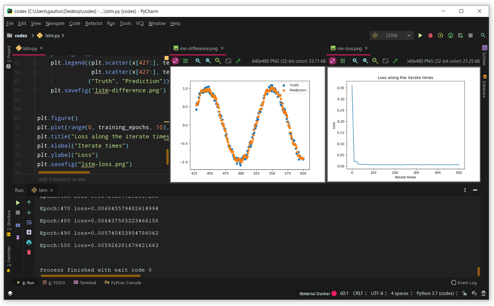

由输出结果可知最终损失为0.0059。


- 训练误差随迭代次数的变化图以及测试集的预测值和真实值的对比图

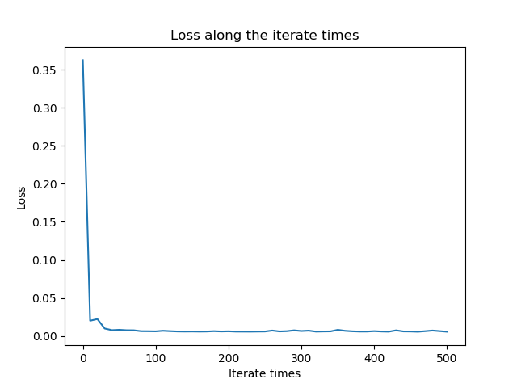

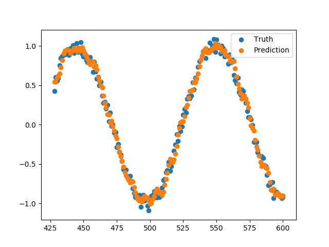


####　二、基于作业一中的LSTM循环神经网络应用Dropout正则化方法

在输出层的输入添加Dropout层，进行两次试验，Dropout比例分别设为0.2和0.4，画出训练误差随迭代次数的变化图以及测试集的预测值和真实值的对比图。

- 在LSTM循环神经网络输出层添加Dropout层

```python
dropout = tf.nn.dropout(last_state.h, rate=dropout_rate)
prediction = tf.nn.bias_add(tf.matmul(dropout, w), b)
```


> 当dropout_rate = 0.2时

- 结果

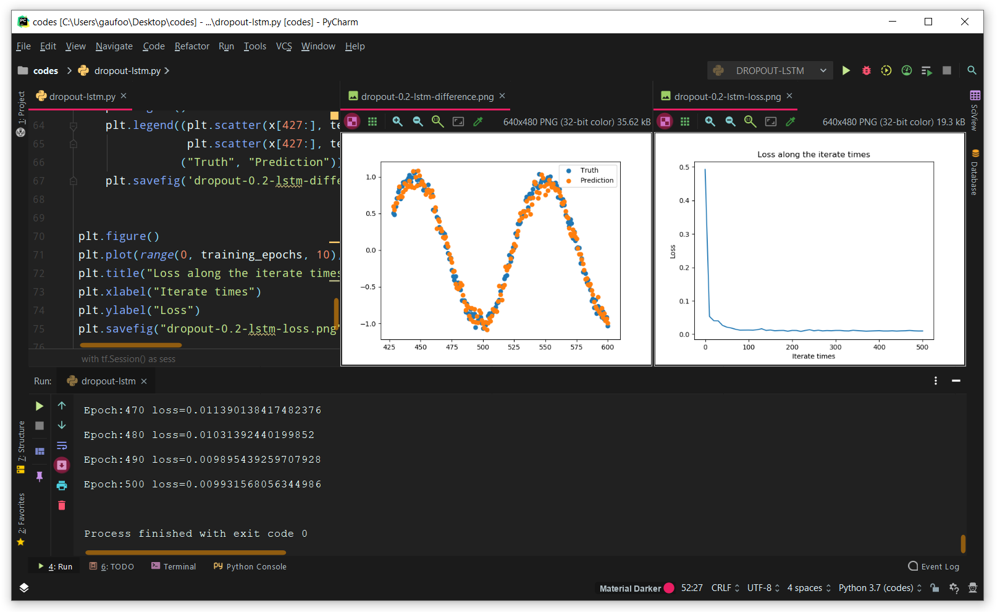

由输出结果可知最终损失为0.0099。


- 训练误差随迭代次数的变化图以及测试集的预测值和真实值的对比图

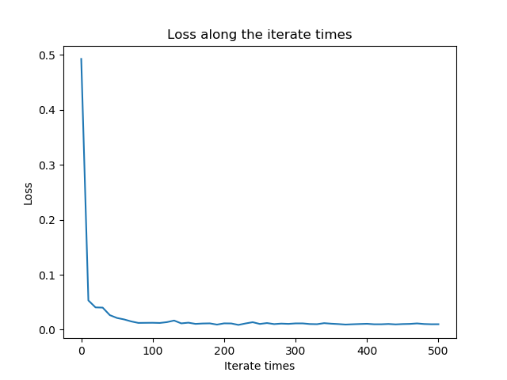

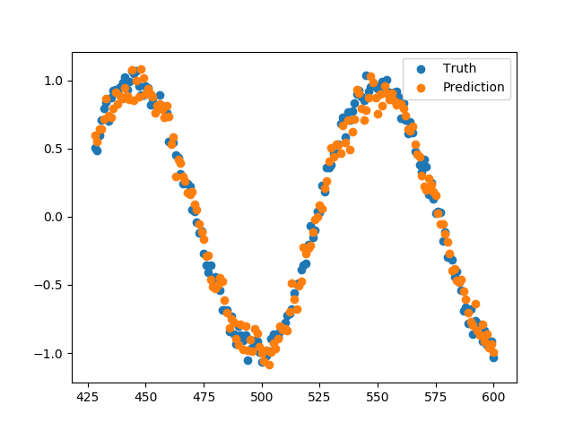


> 当dropout_rate = 0.4时

- 结果

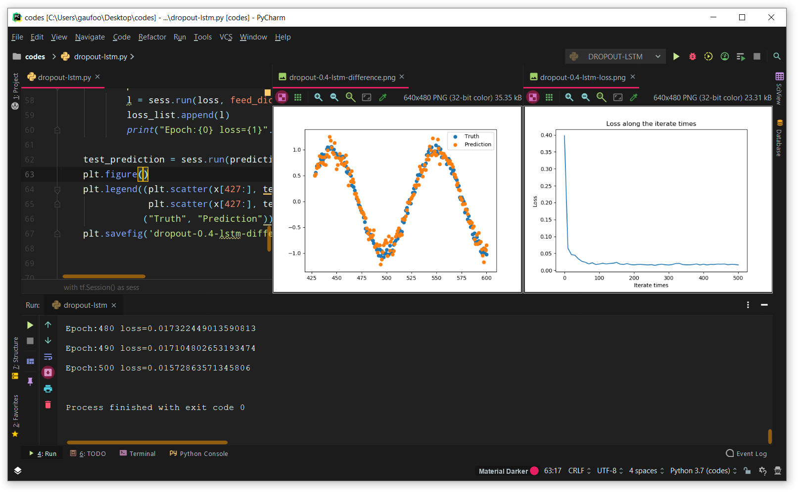

由输出结果可知最终损失为0.0157。


- 训练误差随迭代次数的变化图以及测试集的预测值和真实值的对比图

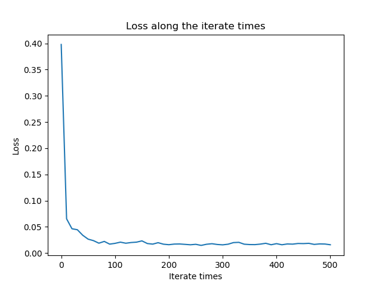

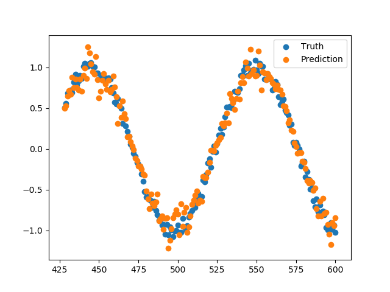


#### 三、基于作业一中的LSTM循环神经网络应用不同的优化方法

##### 1. 使用随机梯度下降算法(tf.train.GradientDescentOptimizer)

- 结果

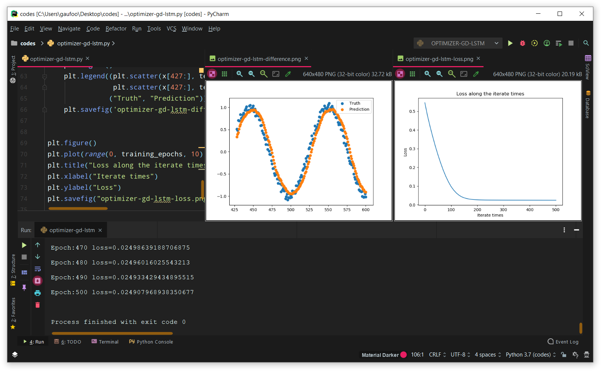

由输出结果可知最终损失为0.0249。


- 训练误差随迭代次数的变化图以及测试集的预测值和真实值的对比图

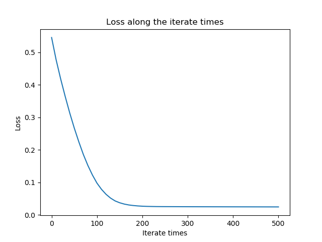

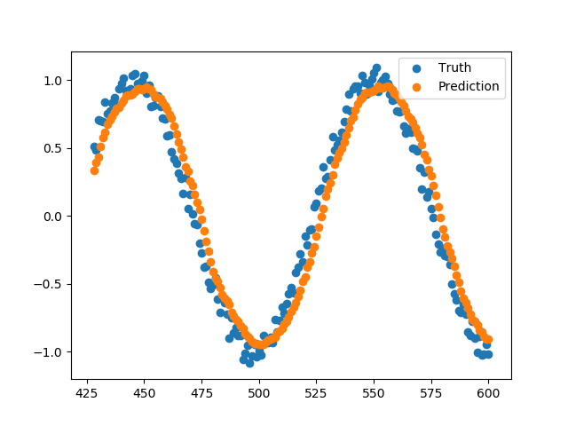


##### 2. 使用动量梯度下降算法(tf.train.MomentumOptimizer)

- 结果

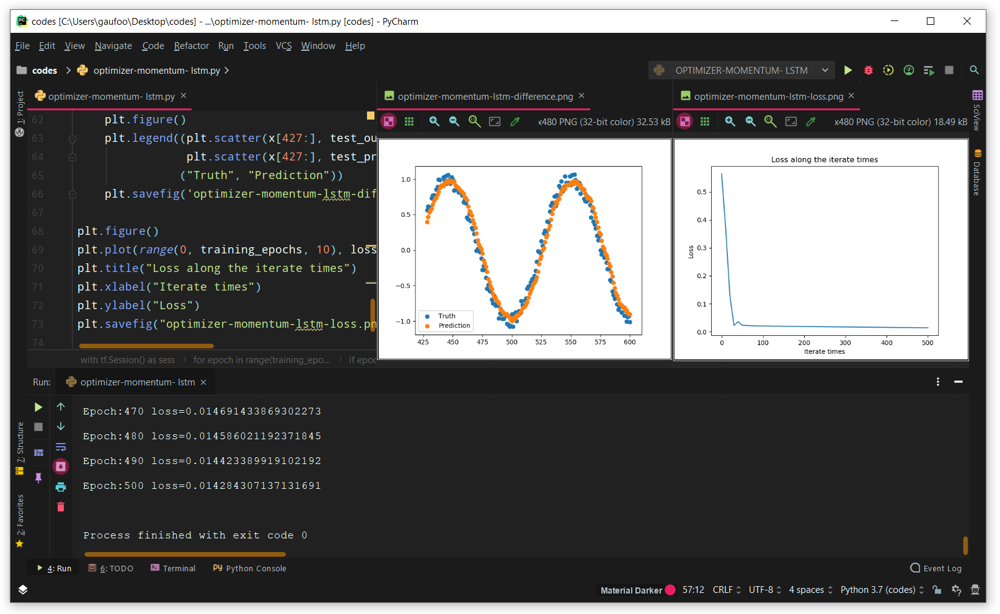

由输出结果可知最终损失为0.0142。


- 训练误差随迭代次数的变化图以及测试集的预测值和真实值的对比图

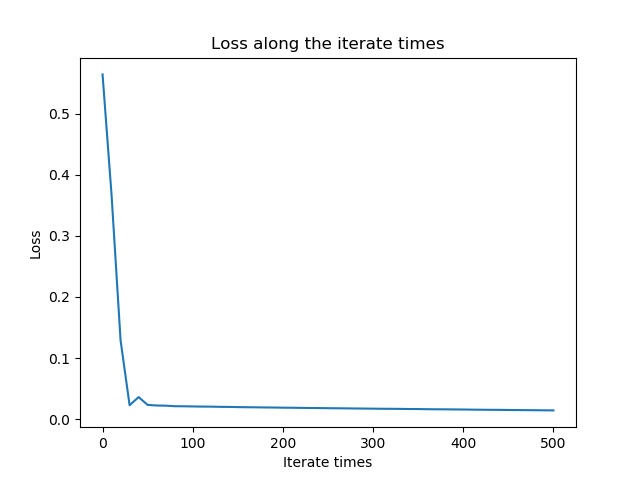

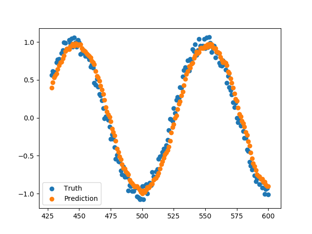


##### 3. 使用Adam优化算法(tf.train.AdamOptimizer)

- 结果

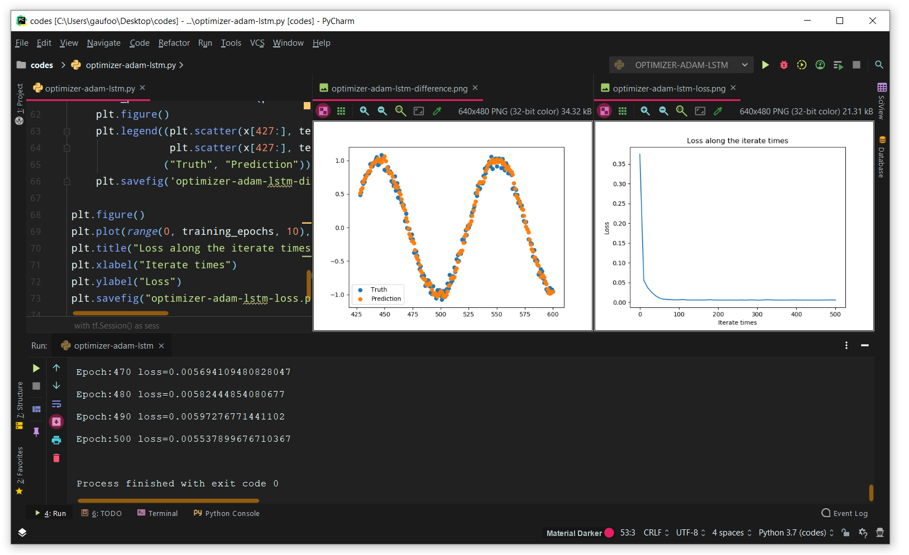

由输出结果可知最终损失为0.0055。


- 训练误差随迭代次数的变化图以及测试集的预测值和真实值的对比图

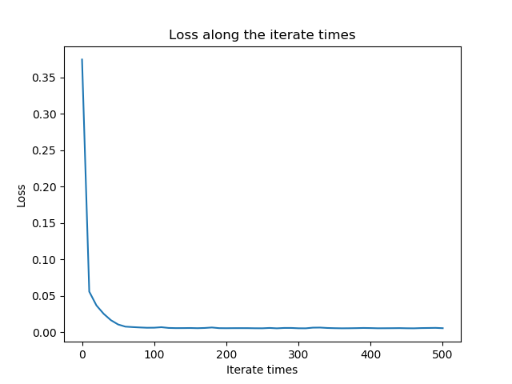

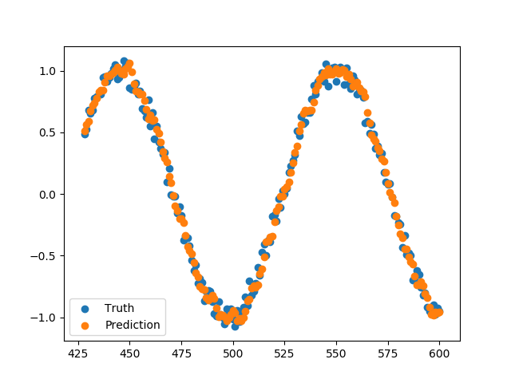


对LSTM循环神经网络应用以上三种优化算法，通过以上数据可以发现，对于此问题来说，使用Adam优化算法所能达到的学习效果最好，其次是动量梯度下降算法，最后是随机梯度下降算法。