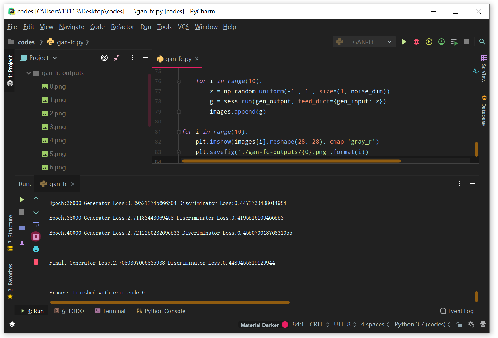
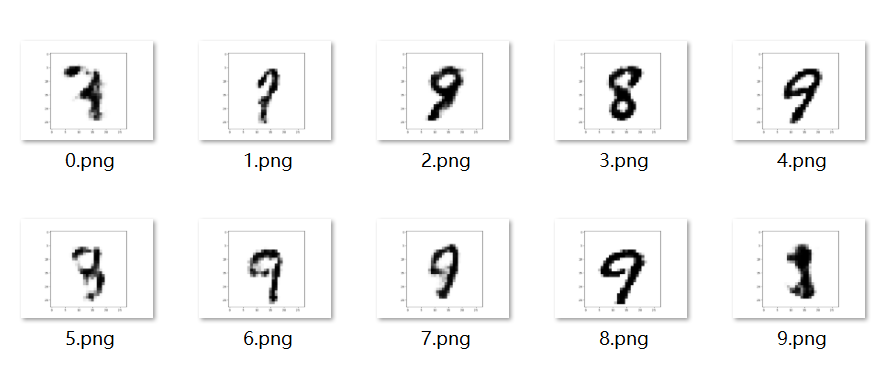
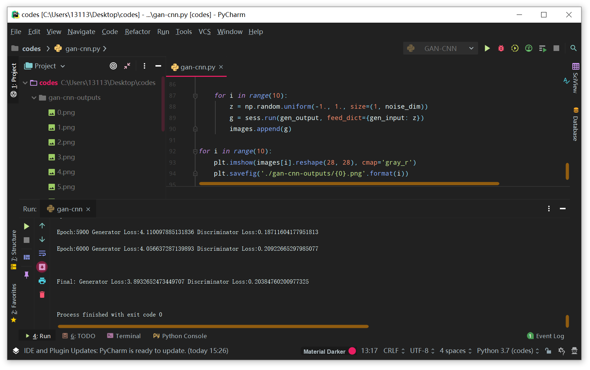
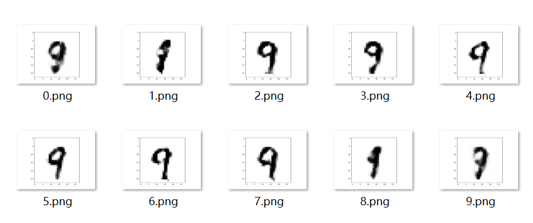

## 神经网络与深度学习第四次作业

###### 计科一班 陈杨 201730612499


#### 一、生成对抗网络生成MNIST手写数字

##### 1. 模型架构(生成器和判别器都使用全连接网络)

> ##### 生成器：
>
> 输入维度：100
>
> 隐含层维度(ReLU)：256
>
> 输出层维度(Sigmoid)：784
>
> ##### 判别器：
>
> 输入维度：784
>
> 隐含层维度(ReLU)：256
>
> 输出层维度(Sigmoid)：1

##### 训练完网络，从噪声中生成10张手写数字图片(提交最终的生成器损失和判别器损失以及生成的图片)

- 获取数据集

```python
# 获取MNIST数据集
from tensorflow.examples.tutorials.mnist import input_data
mnist = input_data.read_data_sets("MNIST_data", one_hot=True)
```


- 定义全局参数

```python
# 定义各内容维度

# 图片输入维度为28×28=784
img_dim = 784
# 生成器中间隐含层维度为256
gen_dim = 256
# 判别器中间隐含层维度为256
dis_dim = 256
# 随机噪声维度为100
noise_dim = 100

# 定义超参数
batch_size = 128
training_epochs = 40001
learning_rate = 0.0002
```


- 定义模型参数及占位符

```python
# 定义生成器及判别器占位符
gen_input = tf.placeholder(tf.float32, shape=[None, noise_dim])
dis_input = tf.placeholder(tf.float32, shape=[None, img_dim])

# 定义生成器及判别器权重
def weight_init(shape):
    return tf.random_normal(shape=shape, 
                            stddev=1. / tf.sqrt(shape[0] / 2.))

w1_gen = tf.Variable(weight_init([noise_dim, gen_dim]))
w2_gen = tf.Variable(weight_init([gen_dim, img_dim]))
w1_dis = tf.Variable(weight_init([img_dim, dis_dim]))
w2_dis = tf.Variable(weight_init([dis_dim, 1]))

# 定义生成器及判别器偏置
b1_gen = tf.Variable(tf.zeros([gen_dim]))
b2_gen = tf.Variable(tf.zeros([img_dim]))
b1_dis = tf.Variable(tf.zeros([dis_dim]))
b2_dis = tf.Variable(tf.zeros([1]))
```


- 定义模型

```python
# 生成器使用全连接网络
def generator(x):
    hidden = tf.nn.relu(tf.add(tf.matmul(x, w1_gen), b1_gen))
    output = tf.nn.sigmoid(tf.add(tf.matmul(hidden, w2_gen), b2_gen))
    return output

# 判别器使用全连接网络
def discriminator(x):
    hidden = tf.nn.relu(tf.add(tf.matmul(x, w1_dis), b1_dis))
    output = tf.nn.sigmoid(tf.add(tf.matmul(hidden, w2_dis), b2_dis))
    return output

# 生成器输出
gen_output = generator(gen_input)

# 判别器输出，包括对真实图片的判别和对生成图片的判别
dis_real_output = discriminator(dis_input)
dis_fake_output = discriminator(gen_output)

# 定义损失、优化器
vars_gen = [w1_gen, w2_gen, b1_gen, b2_gen]
vars_dis = [w1_dis, w2_dis, b1_dis, b2_dis]

loss_gen = -tf.reduce_mean(tf.log(dis_fake_output))
loss_dis = -tf.reduce_mean(tf.log(dis_real_output) + tf.log(1. - dis_fake_output))

optimizer_gen = tf.train.AdamOptimizer(learning_rate=learning_rate)
				  .minimize(loss_gen, var_list=vars_gen)
optimizer_dis = tf.train.AdamOptimizer(learning_rate=learning_rate)
				  .minimize(loss_dis, var_list=vars_dis)

```


- 开始训练

```python
images = []
with tf.Session() as sess:
    
    # 初始化
    tf.global_variables_initializer().run()

    # 进行每趟训练
    for epoch in range(training_epochs):
        # 选取小批量图像作为判别器判别真实数据的输入
        batch_images, _ = mnist.train.next_batch(batch_size)
        # 选取随机噪声作为生成器输入
        noise = np.random.uniform(-1, 1, size=[batch_size, noise_dim])
        feed_dict = {dis_input: batch_images, gen_input: noise}
        _, _, gl, dl = sess.run([optimizer_gen, optimizer_dis, loss_gen, loss_dis],
                                feed_dict=feed_dict)
        # 输出每趟训练结果
        if epoch % 2000 == 0:
            print("Epoch:{0} Generator Loss:{1} Discriminator Loss:{2}"
                  .format(epoch, gl, dl))

    # 输出生成器和判别器的最终损失
    finalLoss_gen, finalLoss_dis = sess.run([loss_gen, loss_dis], feed_dict=feed_dict)
    print("\nFinal: Generator Loss:{0} Discriminator Loss:{1}"
          .format(finalLoss_gen, finalLoss_dis))

    # 测试生成器以生成手写字图片
    for i in range(10):
        z = np.random.uniform(-1., 1., size=(1, noise_dim))
        g = sess.run(gen_output, feed_dict={gen_input: z})
        images.append(g)
```


- 输出生成器所生成图片

```python
for i in range(10):
    plt.imshow(images[i].reshape(28, 28), cmap='gray_r')
    plt.savefig('./gan-fc-outputs/{0}.png'.format(i))
```


##### 最终的生成器损失和判别器损失



由输出结果可知最终的生成器损失为2.7080，判别器损失为0.4489。


##### 生成器从噪声中生成的10张手写数字图片




##### 2. 模型架构(生成器使用全连接网络，判别器使用卷积神经网络)

> ##### 生成器：
>
> 输入维度：100
>
> 隐含层维度(ReLU)：256
>
> 输出层维度(Sigmoid)：784
>
> ##### 判别器：
>
> 输入维度：28×28
>
> 卷积层：卷积核大小为5×5，卷积核个数为16，padding使用'SAME'，stride为1，激活函数为ReLU
>
> 池化层：使用最大池化，核大小为2×2，stride为2
>
> 全连接层：隐含单元数为256，激活函数为ReLU
>
> 输出层维度：1，激活函数为Sigmoid

##### 训练完网络，从噪声中生成10张手写数字图片(提交最终的生成器损失和判别器损失以及生成的图片)

- 此网络的代码实现与上一题类似，不同之处在于判别器模型架构的更改：

```python
# 判别器权重
w1_dis = tf.Variable(weight_init([5, 5, 1, 16]))
w2_dis = tf.Variable(weight_init([3136, 256]))
w3_dis = tf.Variable(weight_init([256, 1]))

# 判别器偏置
b1_dis = tf.Variable(tf.zeros([16]))
b2_dis = tf.Variable(tf.zeros([256]))
b3_dis = tf.Variable(tf.zeros([1]))

# 判别器使用卷积神经网络
def discriminator(x):
    # 卷积层
    convolution = tf.nn.conv2d(tf.reshape(x, [-1, 28, 28, 1]), w1_dis, 
                               strides=[1, 1, 1, 1], padding=padding)
    hidden = tf.nn.relu(tf.nn.bias_add(convolution, b1_dis))
    # 池化层
    pooling = tf.nn.max_pool(hidden, ksize=[1, 2, 2, 1],
                             strides=[1, 2, 2, 1], padding=padding)
    # 全连接层
    full_connection = tf.nn.relu(tf.nn.bias_add(
        tf.matmul(tf.reshape(pooling, [-1, 3136]), w2_dis), b2_dis))
    # 输出层
    output = tf.nn.sigmoid(tf.nn.bias_add(tf.matmul(full_connection, w3_dis), b3_dis))
    return output

# 增加了一组参数
vars_dis = [w1_dis, w2_dis, w3_dis, b1_dis, b2_dis, b3_dis]
```


##### 最终的生成器损失和判别器损失



由输出结果可知最终的生成器损失为3.8933，判别器损失为0.2038。


##### 生成器从噪声中生成的10张手写数字图片




##### 3. 小结

> 训练中存在的问题

通过以上的训练结果可以发现，对于以上两种模型架构，最终呈现出来的生成器损失都是远高于判别器损失的，这说明在训练过程中二者没能达到较好的平衡；且通过观察最终生成的手写体图片可以发现，所生成的数字大多数同一个数字，说明存在生成器仅从单一模式输出样本的问题，也就是模式崩溃。


> 解决策略

通过搜索发现有以下几种解决办法：

- Feature Matching
- Minibatch discrimination
- One-sided label smoothing
- Historical averaging
- Batch normalization
- Balance between discriminator & generator

鉴于复杂度和机器算力的约束，本次作业中我只简要了解了以上方法，暂未进行代码实现及验证。